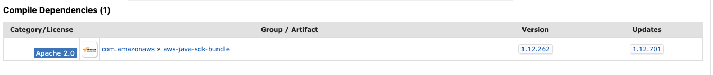
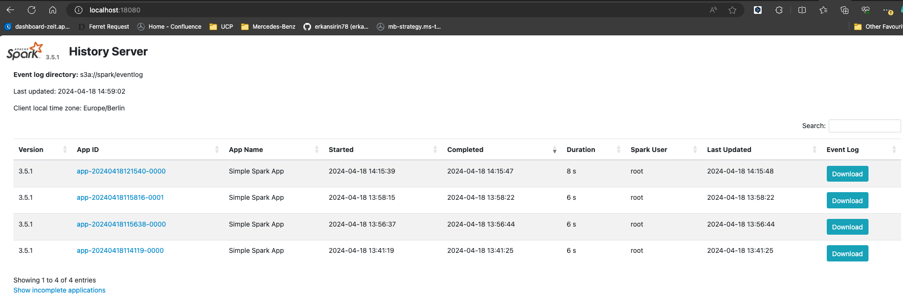
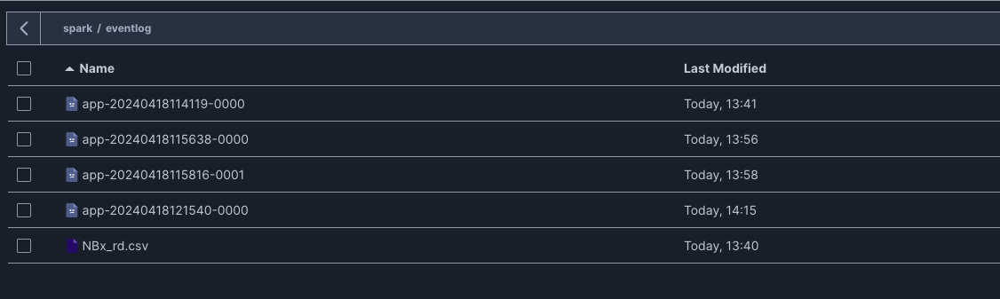

## Troubleshooting while setting up Spark with Minio

### Hadoop and AWS Package Dependencies

To enable Read/Write operations with S3 Object Storage, you need to have the following packages in the `$SPARKHOME/jars` folder:

- hadoop-aws-{version}
- hadoop-common-{version}

The selection of `{version}` should also consider package dependencies. For instance, if you choose version `3.3.4` for `hadoop-aws` and `hadoop-common`, the required dependencies are:

- aws-java-sdk-1.12.262
- [aws-java-sdk-bundle-1.12.262](https://mvnrepository.com/artifact/com.amazonaws/aws-java-sdk-bundle/1.12.262)
- aws-java-sdk-s3-1.12.262
- aws-java-sdk-core-1.12.262

How do we determine the appropriate version of dependencies? We refer to the `Compile Dependencies` section in [hadoop-aws-3.3.4](https://mvnrepository.com/artifact/org.apache.hadoop/hadoop-aws/3.3.4)


### Spark default configurations

There are several settings you need to pay attention in `spark-defaults.conf` file
- `spark.hadoop.fs.s3a.endpoint` should be the IP address of minio. For example, `http://172.20.0.6:9000`. If we use `http://minio:9000` then there will be an error come up which is "Unable to resolve the host name `spark.minio`"
```log
The error message "org.apache.hadoop.fs.s3a.AWSClientIOException: getFileStatus on s3a://spark/event-log: com.amazonaws.SdkClientException: Unable to execute HTTP request: spark.minio: Name does not resolve
```
- The paths/values of `spark.history.fs.logDirectory` and `spark.eventLog.dir` should be the same to enable Spark History Server. 

- And also the paths of `spark.history.fs.logDirectory` and `spark.eventLog.dir` should be created before hand 

